# jdk8
## 1、将本项目下载下来直接导入idea中；
## 2、配置以下设置：
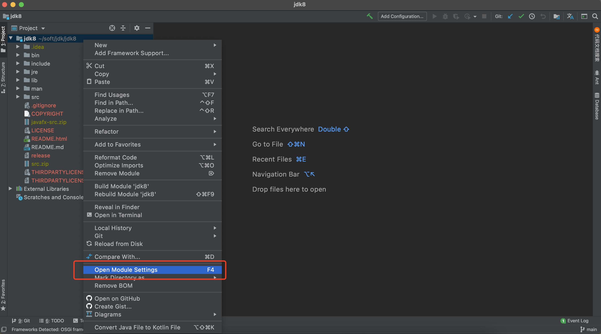
### 1）配置sdk:
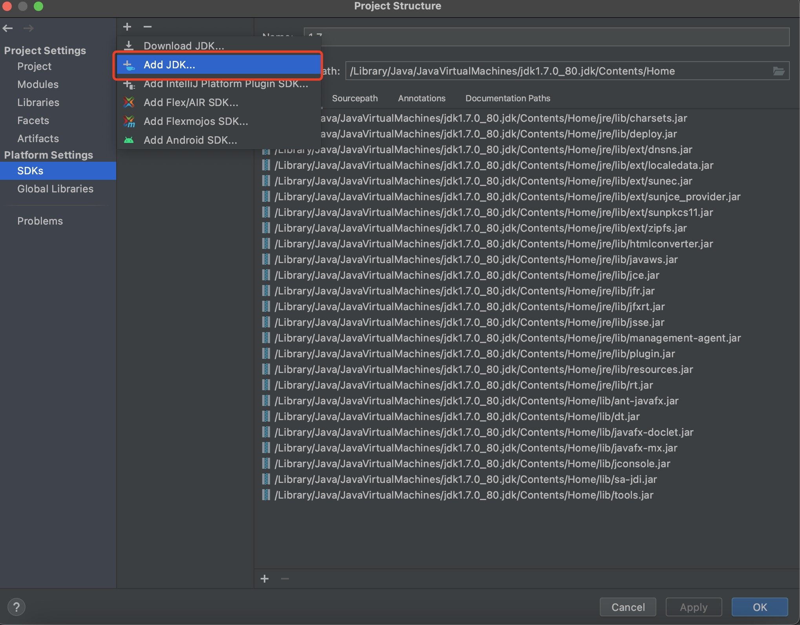
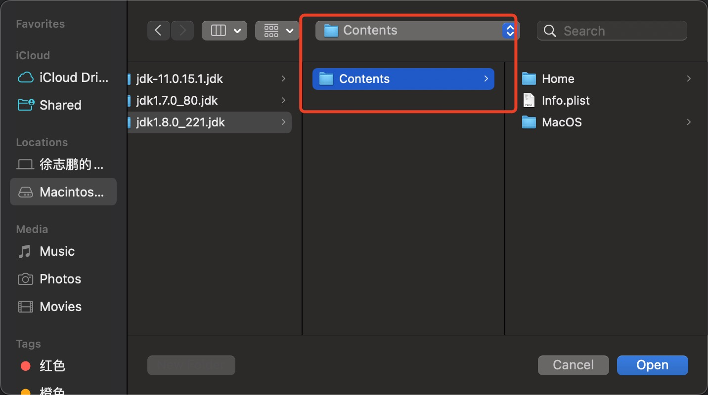
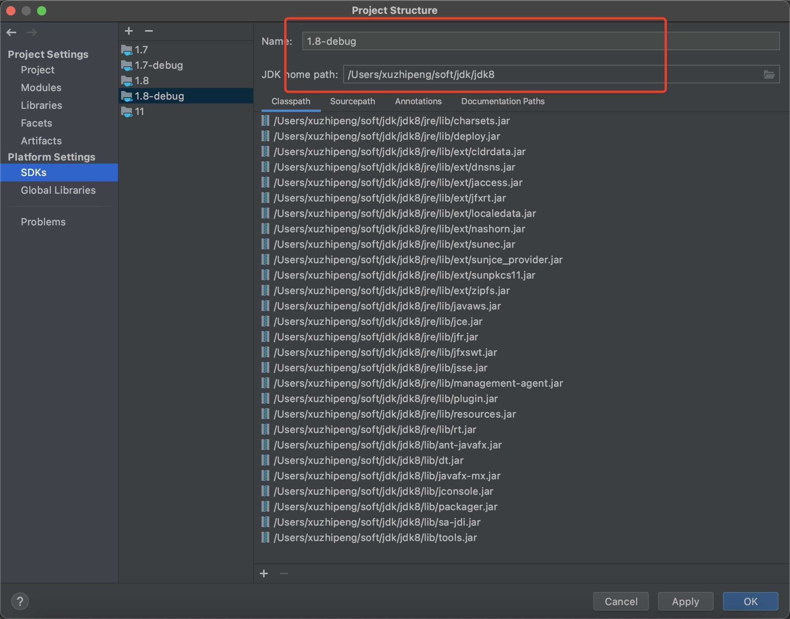
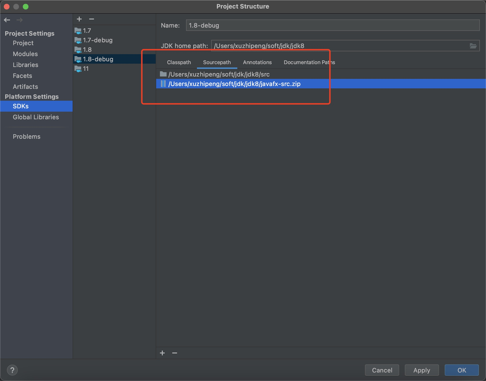
### 2）配置项目：
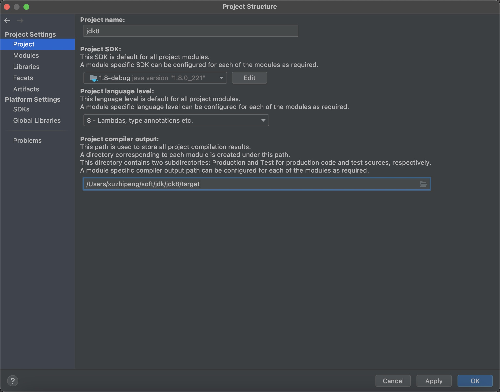
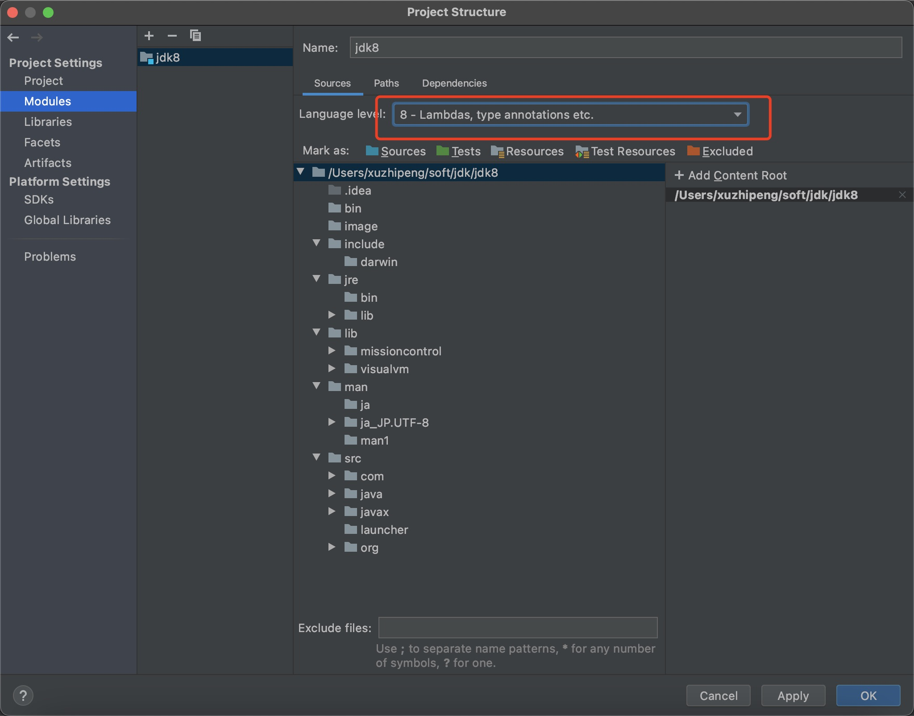
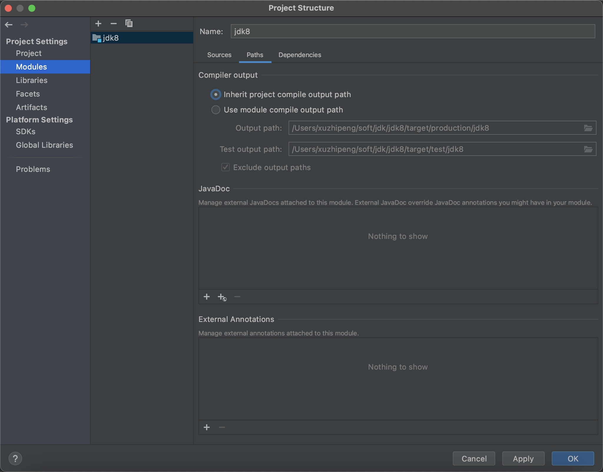
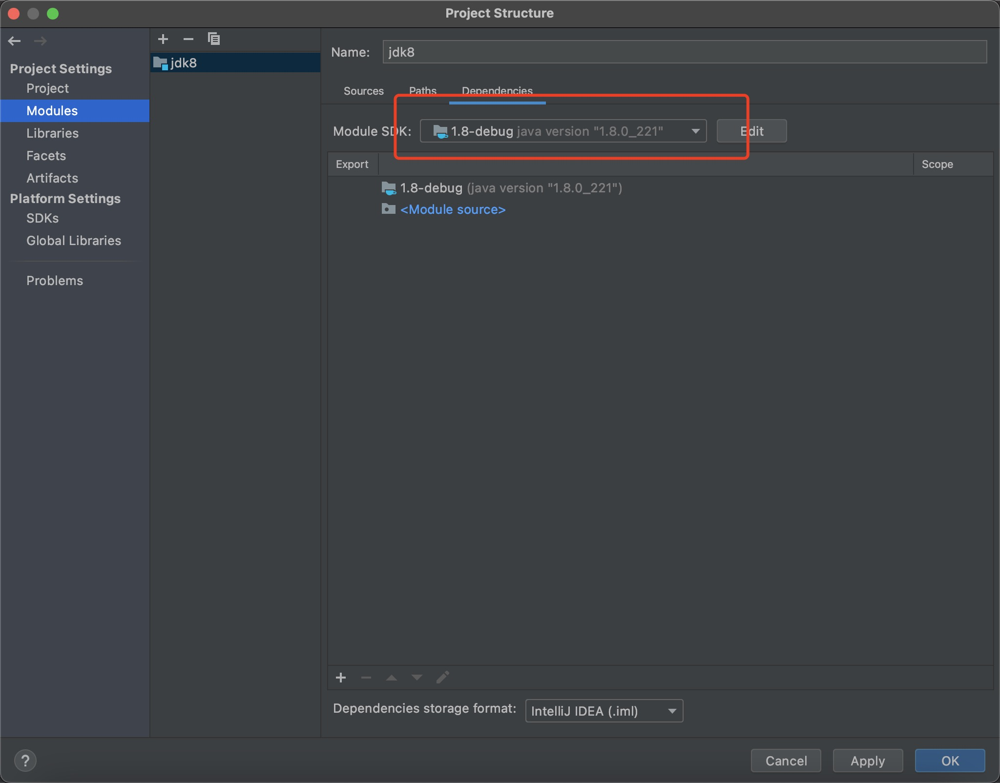
## 3、将src目录设置为Sources Root
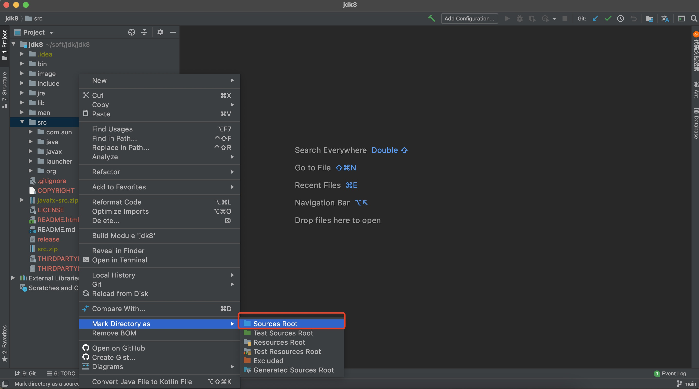
## 4、增大编译时的内存
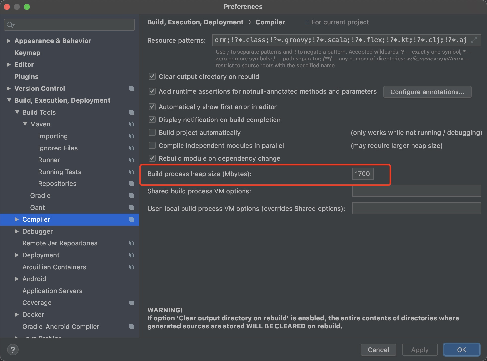
## 5、设置VM参数（让我们编译的代码要跑在jre/lib/rt.jar前面）
-Xbootclasspath/p:/Users/xuzhipeng/soft/jdk/jdk8/target/production/jdk8,
/Users/xuzhipeng/soft/jdk/jdk8/target/production/jdk8是本项目class文件的路径。
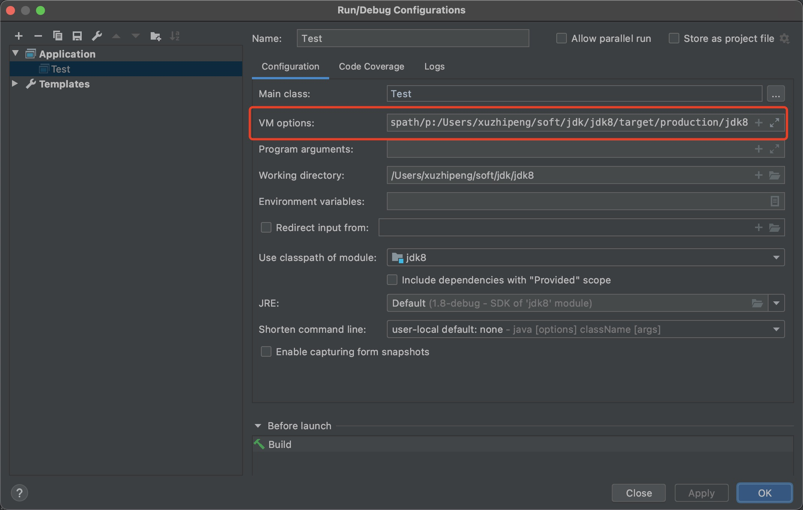
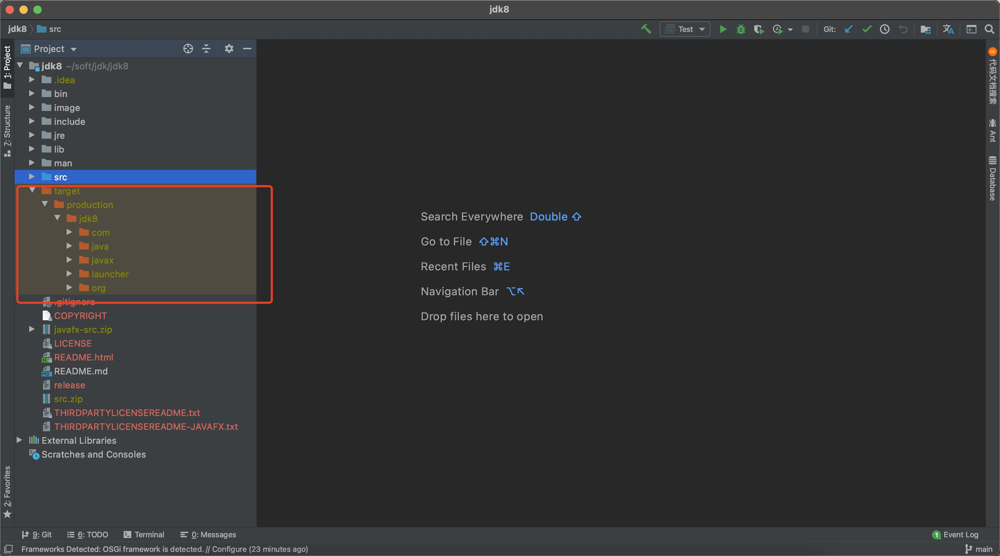
## 6、设置debug的时候可以跳进jdk源码，将java.*和javax.*前面的对勾去掉
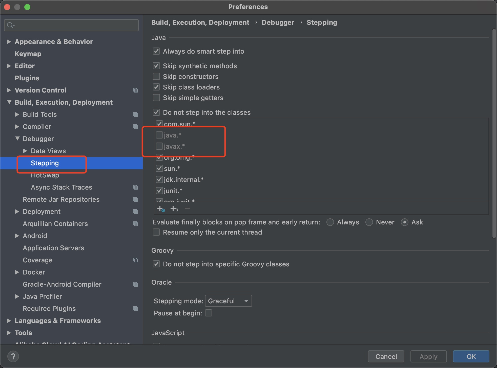